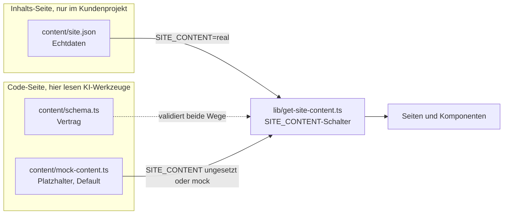

# content-trennung

Code und Kundeninhalte technisch getrennt, damit KI-Werkzeuge nur mit Platzhaltern arbeiten. Mit den Grenzen dieser Absicherung.

Dieses Muster ist kein konstruiertes Beispiel. Es läuft produktiv in meinen Website-Templates, aus denen ich Kundenseiten baue. Dieses Repository ist der herausgelöste Kern davon, ohne Produkt-Logik, ohne Framework-Ballast.

Warum ich das so gebaut habe, und was es im Alltag kostet, steht im Artikel [KI im Kundengeschäft, ohne dass Kundendaten hineingehen](https://www.linkedin.com/pulse/ki-im-kundengesch%C3%A4ft-ohne-dass-kundendaten-kenneth-h%C3%BCdig-3yytf/).

## 1. Das Problem

KI-Coding-Agenten arbeiten, indem sie Dateien lesen. In einem typischen Website-Projekt liegen die Kundendaten mitten im Projekt: Firmenname, Anschrift, Telefonnummer, E-Mail-Adresse, Impressumsangaben, Porträtfotos. Damit landen personenbezogene Daten in Prompts, in Logs und in der Git-Historie, ohne dass das jemand bewusst entschieden hätte.

## 2. Die Lösung

Der Code kennt nur ein Schema und einen Platzhalter-Inhalt. Die echten Kundendaten liegen in einer eigenen Datei, die kein Bauteil direkt importiert. Ein einziger Loader entscheidet über eine Umgebungsvariable, welche der beiden Quellen er nimmt, und validiert beide gegen dasselbe Schema.

In diesem Repository ist `content/site.json` ausgeschlossen. In einem echten Kundenprojekt wird sie committet, weil die Deploy-Plattform sie beim Bauen braucht. Dann gilt der Hinweis zur Git-Historie aus Abschnitt 5 in vollem Umfang.



| Datei | Rolle |
|---|---|
| `content/schema.ts` | Der Vertrag. Zod-Schema, das beide Quellen erfüllen müssen. |
| `content/mock-content.ts` | Der Platzhalter-Inhalt. Default für Build, Tests und jede KI-Session. |
| `content/site.example.json` | Die Form der Echtdaten-Datei, mit erfundenen Werten gefüllt. |
| `lib/get-site-content.ts` | Der einzige Zugang zu den Inhalten. Liest den Schalter, validiert, gibt zurück. |
| `scripts/validate-content.ts` | Prüft eine vorhandene `content/site.json` gegen den Vertrag, ohne Feldwerte auszugeben. |
| `scripts/verify-sandbox.mjs` | Misst, ob eine Sandbox die Deny-Regeln wirklich durchsetzt. Blankes Node ohne Abhängigkeiten, siehe Abschnitt 8. |
| `sandbox-canary.txt` | Zieldatei dafür, ohne schützenswerten Inhalt. Steht in den Deny-Regeln, damit es etwas zu sperren gibt. |
| `.claude/settings.json` | Deny-Regeln für die Pfade mit Echtdaten, lesend und schreibend. |
| `CLAUDE.md` | Die geschriebene Regel für KI-Sessions. |

Der Loader in diesem Repository ist bewusst framework-frei, damit das Muster ohne Next.js lesbar und testbar ist. Produktiv wird er in einer Next.js-App aus Server Components aufgerufen, dort zusätzlich mit `import 'server-only'` und in Reacts `cache()` gewickelt, damit pro Request nur einmal geparst wird.

## 3. Warum der Platzhalterstand gleichzeitig der Auslieferungszustand ist

Das ist der eigentliche Trick, und es ist der Punkt, an dem solche Konzepte sonst sterben. Wenn die saubere Variante Mehrarbeit bedeutet, verliert sie gegen den Termindruck. Also darf sie keine Mehrarbeit bedeuten.

Hier ist der Platzhalter kein Test-Fixture, das jemand zusätzlich pflegen müsste. Er ist der Default des Loaders: `SITE_CONTENT` ungesetzt bedeutet Platzhalter. Gemeint ist der Auslieferungszustand des Templates, nicht die fertige Kundenseite: Das Repository baut, testet und rendert vollständig in dem Zustand, in dem es ausgeliefert wird. Niemand muss vor einer KI-Session Daten wegräumen und niemand muss danach etwas zurückspielen. Der sichere Zustand ist der bequeme Zustand.

Nebeneffekt: Weil das Schema beide Quellen validiert, ist der Platzhalter zugleich die lebende Feld-Referenz. Wer wissen will, welche Felder eine Kundendatei braucht, liest `content/mock-content.ts`, nicht die Datei eines Kunden.

## 4. Die Schichten, von stark nach schwach

1. **Sandbox auf Betriebssystemebene.** Der Prozess kann auf bestimmte Pfade schlicht nicht zugreifen. Das ist die einzige Schicht, die auch dann hält, wenn das Werkzeug etwas tut, das niemand vorhergesehen hat. Sie liegt außerhalb dieses Repositorys, weil sie zur Arbeitsumgebung gehört, nicht zum Projekt. Bei Claude Code unter Linux und WSL wird sie mit `sandbox.enabled` eingeschaltet und speist sich aus denselben `Read(...)`-Regeln: Über jeden gesperrten Pfad bindet sie `/dev/null`, sodass im Namespace des Prozesses dort keine Datei mehr liegt. Ein Leseversuch endet mit `EACCES`, ganz gleich, ob er aus dem Werkzeug, einem Shell-Befehl oder einem Interpreter kommt. Zwei Schalter gehören dazu: `allowUnsandboxedCommands: false`, sonst bleibt der Ausbruch möglich, und `failIfUnavailable: true`, sonst läuft alles unsandboxed weiter, wenn die Sandbox nicht startet.
2. **Deny-Regeln im KI-Werkzeug.** `.claude/settings.json` sperrt `content/site.json`, `public/kunde/**` und die `.env`-Dateien, jeweils fürs Lesen und fürs Ändern. Wirkt bei den eingebauten Dateiwerkzeugen und bei Shell-Befehlen, die das Werkzeug als Lesezugriff erkennt. Wo genau diese Erkennung endet, steht in Abschnitt 5.
3. **Platzhalter als Standard.** Siehe oben. Diese Schicht schützt nicht gegen einen entschlossenen Zugriff, sie sorgt dafür, dass der Normalfall gar nicht erst in die Nähe der Echtdaten kommt.
4. **Zugangsdaten nur in der Deploy-Umgebung.** `SITE_CONTENT=real` und alles, was sonst noch Zugriff eröffnet, ist in der Deploy-Umgebung gesetzt und nirgends im Repository.
5. **Die geschriebene Regel.** `CLAUDE.md` sagt, was tabu ist und dass Reviews nur gegen den Mock laufen. Das ist die schwächste Schicht, weil sie nur wirkt, solange das Modell sie befolgt. Sie steht trotzdem da, weil sie den Menschen erklärt, warum die anderen Schichten existieren. Bemerkenswert am Test aus Abschnitt 5: Genau diese Schicht hat zweimal gehalten, wo die Deny-Regeln nichts ausgerichtet hätten. Zwei Sessions haben den Leseversuch von sich aus verweigert, einmal unter Berufung auf die Tabu-Regel, einmal mit dem Hinweis, die Zieldatei sehe anders aus als beschrieben. Das ist kein Ersatz für die unteren Schichten, aber es ist mehr, als ich dieser Schicht zugetraut hätte.

Die Regelliste hier ist dieselbe, die in meinen produktiven Templates steht. Sie war es eine Weile nicht: Dieses Repository hatte zusätzlich die gängigen Shell-Lesebefehle gesperrt (`cat`, `head`, `tail`, `type`, `Get-Content`), weil ein öffentlich kopierbares Beispiel die bessere Variante zeigen sollte. Nach dem Gate-Test aus Abschnitt 5 sind die Templates nachgezogen, und die `Edit`-Regeln sind überall dazugekommen.

## 5. Wo die Absicherung endet

Drei Dinge sollte man wissen, bevor man dieses Muster als Schutzversprechen weitergibt. Sie stehen hier nicht als Vermutung: Ich habe die Regeln gegen dreizehn Zugriffswege getestet, mit einer Dummy-Datei aus `site.example.json`, und vier davon kamen durch.

**Deny-Regeln greifen nicht überall, und man kann ziemlich genau sagen, wo sie aufhören.** Sie sind keine reine Liste von Kommandonamen. Das Werkzeug analysiert einen Shell-Befehl darauf, ob er eine Datei liest, und gleicht den Pfad gegen die `Read`-Regeln ab. Deshalb scheiterten im Test auch `sed`, `awk` und `jq`, die in keiner Regel stehen. Diese Analyse erkennt ein bekanntes Leseprogramm mit einem Dateiargument. Sie durchschaut zwei Dinge nicht:

- **Einen Wrapper.** `Get-Content` ist gesperrt, `powershell.exe -Command "Get-Content …"` lief durch. Vorne steht `powershell.exe`, und darauf passt keine Regel.
- **Einen Interpreter.** `node -e "require('fs').readFileSync(…)"` lief durch. Beliebiger Code hinter `-e` ist für eine Kommando-Denylist unsichtbar, dasselbe gilt für `python -c`, `perl -e` und `ruby -e`.

Der zweite Punkt ist der wichtigere, und er ist nicht wegzukonfigurieren. Jeder neue Eintrag zieht den nächsten nach, und wer `node` und `python` sperrt, kann in dem Projekt nicht mehr arbeiten. Ein Build-Schritt, ein Testlauf oder ein Werkzeug, das seinerseits Dateien einliest, läuft aus demselben Grund an der Regel vorbei. Die Regel filtert Absichten, die sie versteht, nicht alles, was technisch möglich ist. Genau dafür steht Schicht 1 an erster Stelle: Gegen eine Sandbox auf Betriebssystemebene hilft dem Interpreter sein Interpretersein nicht. Auch das ist gemessen, im selben Aufbau mit eingeschalteter Sandbox: Derselbe Lesezugriff, der ohne sie 33 Bytes zurückgibt, endet mit ihr bei `EACCES`.

**Eine Leseregel ist keine Schreibregel.** `Read(./public/kunde/**)` verhindert, dass die Kundenbilder gelesen werden, und sonst nichts. Im Test konnte ich in dasselbe Verzeichnis schreiben. Die Datei, die ich nicht ansehen darf, durfte ich ersetzen. Für Daten, die nur an dieser einen Stelle liegen, ist das der schlimmere Fall. Deshalb steht jeder geschützte Pfad hier zweimal, als `Read` und als `Edit`. Eine `Write(…)`-Regel wäre der naheliegende dritte Eintrag und ist der falsche: Claude Code wertet sie nicht aus und weist beim Start darauf hin, `Edit(…)` deckt alle dateischreibenden Werkzeuge mit ab.

**Die Git-Historie vergisst nicht.** Wurden Echtdaten einmal committet, liegen sie in der Historie und sind über `git show` rekonstruierbar, auch wenn die Datei im aktuellen Stand gelöscht ist und der Pfad inzwischen in einer Deny-Regel steht. Eine Deny-Regel auf einen Dateipfad deckt das nicht ab. Wer nachträglich aufräumt, muss die Historie umschreiben, nicht die Datei löschen.

Das ist kein Randfall, sondern der Normalfall im Kundenprojekt. Sobald die Deploy-Plattform aus dem Repository baut, muss `content/site.json` dort liegen, und ab dem ersten Commit steht sie in der Historie. Die Deny-Regel hält KI-Werkzeuge vom aktuellen Stand der Datei fern. Vom Rest der Historie hält sie niemanden fern.

Daraus folgt die Formulierung, die trägt:

> So konfiguriert, dass KI-Werkzeuge nur mit Platzhaltern arbeiten.

Und nicht:

> Zugriff technisch unmöglich.

Der Unterschied klingt nach Wortklauberei. Er ist es nicht. Der erste Satz beschreibt eine Konfiguration, die man prüfen kann. Der zweite ist ein Versprechen, das dieses Muster allein nicht halten kann.

## 6. Schutzniveau A und B

**Niveau A, dieses Repository.** Die Echtdaten liegen als eigene Datei im Projektordner, vom Code getrennt und von den KI-Werkzeugen weggeregelt. Der Normalbetrieb sieht sie nie. Ein Prozess, der bewusst oder versehentlich am Werkzeug vorbei liest, kann sie erreichen. Für den Alltag reicht das, und es kostet nichts, weil der Platzhalterstand ohnehin der Auslieferungszustand ist.

In diesem Demo-Repository ist die Datei zusätzlich ganz aus dem Repository ausgeschlossen. Im Kundenprojekt ist sie es nicht, weil die Deploy-Plattform sie beim Bauen braucht. Niveau A schützt dort also den Arbeitsalltag, nicht die Historie.

**Niveau B, die harte Variante.** Die Echtdaten liegen gar nicht erst im Projekt. Sie werden beim Bauen über einen Zugang geladen, den es nur in der Deploy-Umgebung gibt, etwa aus einem Secret Store, einem Headless CMS oder einer API mit einem Token, das lokal nirgends existiert. Auf dem Entwicklungsrechner ist die Datei dann nicht abwesend, weil eine Regel sie verbirgt, sondern weil sie dort schlicht nicht existiert. Und weil sie nie committet wird, landet sie auch nicht in der Historie. Erst das trägt die Aussage, dass ein lokal laufendes Werkzeug die Daten nicht erreichen kann.

Der Weg von A nach B ist im Loader kurz: Statt `readFileSync` steht dort ein Abruf über den Zugang, den nur der Build hat. Der Rest des Musters, Schema, Platzhalter-Default, Validierung, bleibt unverändert. Genau dafür ist der Loader die einzige Stelle, die die Quelle kennt.

## 7. Quickstart

```bash
npm install
npm test          # Schema-Parse des Mocks, Loader-Verhalten mit und ohne Schalter
npm run typecheck
```

Den Echtdaten-Pfad ausprobieren, ohne echte Daten:

```bash
cp content/site.example.json content/site.json
npm run validate:content   # prüft die Datei gegen den Vertrag, ohne Feldwerte auszugeben
rm content/site.json       # zurück in den Auslieferungszustand
```

Die Testsuite läuft bewusst gegen ein Repository ohne `content/site.json`, weil genau das der Auslieferungszustand ist. Solange die Datei existiert, schlägt der Test für den Fehlerfall fehl. Den Schalter selbst setzt man in der Deploy-Umgebung, unter PowerShell lokal mit `$env:SITE_CONTENT = "real"`.

In diesem Repository ist `content/site.json` per `.gitignore` ausgeschlossen und steht zusätzlich in den Deny-Regeln. Sie taucht hier also weder im Repository noch in einer KI-Session auf. Im Kundenprojekt gilt nur der zweite Teil, siehe Abschnitt 5.

## 8. Die eigene Absicherung nachmessen

Abschnitt 4 stellt fünf Schichten auf, und Abschnitt 5 sagt, wo sie enden. Beides sind Behauptungen, solange man sie nicht prüft. Für die unterste und wichtigste Schicht geht das mit einem Befehl:

```bash
npm run verify:sandbox
```

Das Skript liest `sandbox-canary.txt`, eine Datei ohne schützenswerten Inhalt, die einzig deshalb existiert, weil sie in den Deny-Regeln steht. Echtdaten fasst es nie an.

| Ausgabe | Bedeutung |
|---|---|
| `Sandbox aktiv: … scheitert mit EACCES` | Die Regeln greifen auf Dateisystemebene. Auch ein Unterprozess kommt nicht vorbei |
| `Sandbox aktiv: … liest sich als leer` | Dasselbe, der Pfad ist im Namensraum überdeckt |
| `Keine Sandbox aktiv: … normal lesbar` | Die Regeln wirken nur im KI-Werkzeug. Ein `node -e` liest an ihnen vorbei |

Der dritte Fall ist kein Defekt dieses Repositorys, sondern eine Aussage über die Arbeitsumgebung, und er ist der Normalfall bei einer frischen Installation. Das Skript nennt dann die nötige Konfiguration.

**Nicht in die CI einbauen.** Dort läuft keine Sandbox, das Skript meldet korrekt einen ungeschützten Zustand und färbt den Lauf rot. Es gehört auf den Rechner, auf dem die KI-Sitzungen stattfinden.

Das Skript ist bewusst blankes Node, ohne `tsx` und ohne jede Abhängigkeit, obwohl der Rest des Repositorys TypeScript nutzt. Der Grund ist ein Fund aus genau diesem Test: `tsx` öffnet beim Start einen IPC-Socket unter `/tmp`, und eine aktive Sandbox verweigert das mit `EPERM`. Die erste Fassung scheiterte deshalb, bevor sie zur Messung kam. **Ein Werkzeug, das die Sandbox prüft, darf nicht an ihr scheitern.** Derselbe Fallstrick trifft jede Toolchain mit IPC oder Watch-Modus, und er ist beim Arbeiten in einer Sandbox das häufigste Ärgernis.

## Lizenz

MIT, siehe [LICENSE](LICENSE).
