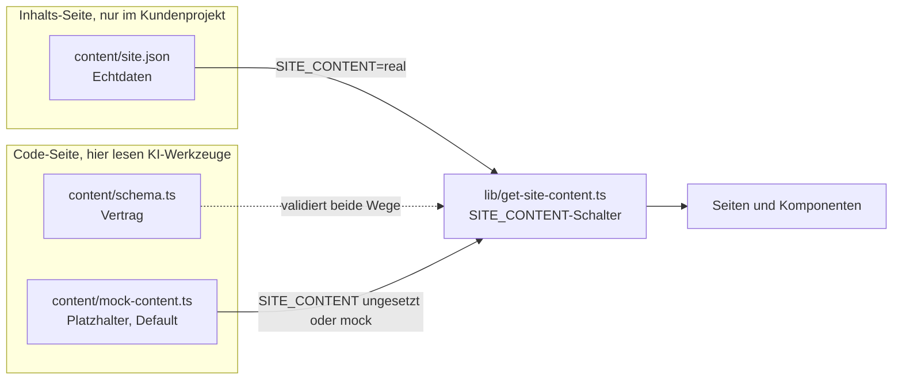

# content-trennung

Code und Kundeninhalte technisch getrennt, damit KI-Werkzeuge nur mit Platzhaltern arbeiten. Mit den Grenzen dieser Absicherung.

Dieses Muster ist kein konstruiertes Beispiel. Es läuft produktiv in meinen Website-Templates, aus denen ich Kundenseiten baue. Dieses Repository ist der herausgelöste Kern davon, ohne Produkt-Logik, ohne Framework-Ballast.

## 1. Das Problem

KI-Coding-Agenten arbeiten, indem sie Dateien lesen. In einem typischen Website-Projekt liegen die Kundendaten mitten im Projekt: Firmenname, Anschrift, Telefonnummer, E-Mail-Adresse, Impressumsangaben, Porträtfotos. Damit landen personenbezogene Daten in Prompts, in Logs und in der Git-Historie, ohne dass das jemand bewusst entschieden hätte.

## 2. Die Lösung

Der Code kennt nur ein Schema und einen Platzhalter-Inhalt. Die echten Kundendaten liegen in einer eigenen Datei, die kein Bauteil direkt importiert. Ein einziger Loader entscheidet über eine Umgebungsvariable, welche der beiden Quellen er nimmt, und validiert beide gegen dasselbe Schema.

In diesem Repository ist `content/site.json` ausgeschlossen. In einem echten Kundenprojekt wird sie committet, weil die Deploy-Plattform sie beim Bauen braucht. Dann gilt der Hinweis zur Git-Historie aus Abschnitt 5 in vollem Umfang.



| Datei | Rolle |
|---|---|
| `content/schema.ts` | Der Vertrag. Zod-Schema, das beide Quellen erfüllen müssen. |
| `content/mock-content.ts` | Der Platzhalter-Inhalt. Default für Build, Tests und jede KI-Session. |
| `content/site.example.json` | Die Form der Echtdaten-Datei, mit erfundenen Werten gefüllt. |
| `lib/get-site-content.ts` | Der einzige Zugang zu den Inhalten. Liest den Schalter, validiert, gibt zurück. |
| `scripts/validate-content.ts` | Prüft eine vorhandene `content/site.json` gegen den Vertrag, ohne Feldwerte auszugeben. |
| `.claude/settings.json` | Deny-Regeln für die Pfade mit Echtdaten. |
| `CLAUDE.md` | Die geschriebene Regel für KI-Sessions. |

Der Loader in diesem Repository ist bewusst framework-frei, damit das Muster ohne Next.js lesbar und testbar ist. Produktiv wird er in einer Next.js-App aus Server Components aufgerufen, dort zusätzlich mit `import 'server-only'` und in Reacts `cache()` gewickelt, damit pro Request nur einmal geparst wird.

## 3. Warum der Platzhalterstand gleichzeitig der Auslieferungszustand ist

Das ist der eigentliche Trick, und es ist der Punkt, an dem solche Konzepte sonst sterben. Wenn die saubere Variante Mehrarbeit bedeutet, verliert sie gegen den Termindruck. Also darf sie keine Mehrarbeit bedeuten.

Hier ist der Platzhalter kein Test-Fixture, das jemand zusätzlich pflegen müsste. Er ist der Default des Loaders: `SITE_CONTENT` ungesetzt bedeutet Platzhalter. Gemeint ist der Auslieferungszustand des Templates, nicht die fertige Kundenseite: Das Repository baut, testet und rendert vollständig in dem Zustand, in dem es ausgeliefert wird. Niemand muss vor einer KI-Session Daten wegräumen und niemand muss danach etwas zurückspielen. Der sichere Zustand ist der bequeme Zustand.

Nebeneffekt: Weil das Schema beide Quellen validiert, ist der Platzhalter zugleich die lebende Feld-Referenz. Wer wissen will, welche Felder eine Kundendatei braucht, liest `content/mock-content.ts`, nicht die Datei eines Kunden.

## 4. Die Schichten, von stark nach schwach

1. **Sandbox auf Betriebssystemebene.** Der Prozess kann auf bestimmte Pfade schlicht nicht zugreifen. Das ist die einzige Schicht, die auch dann hält, wenn das Werkzeug etwas tut, das niemand vorhergesehen hat. Sie liegt außerhalb dieses Repositorys, weil sie zur Arbeitsumgebung gehört, nicht zum Projekt.
2. **Deny-Regeln im KI-Werkzeug.** `.claude/settings.json` sperrt `content/site.json`, `public/kunde/**` und die `.env`-Dateien. Wirkt bei den eingebauten Dateiwerkzeugen und bei Shell-Befehlen, die das Werkzeug als Lesezugriff erkennt.
3. **Platzhalter als Standard.** Siehe oben. Diese Schicht schützt nicht gegen einen entschlossenen Zugriff, sie sorgt dafür, dass der Normalfall gar nicht erst in die Nähe der Echtdaten kommt.
4. **Zugangsdaten nur in der Deploy-Umgebung.** `SITE_CONTENT=real` und alles, was sonst noch Zugriff eröffnet, ist in der Deploy-Umgebung gesetzt und nirgends im Repository.
5. **Die geschriebene Regel.** `CLAUDE.md` sagt, was tabu ist und dass Reviews nur gegen den Mock laufen. Das ist die schwächste Schicht, weil sie nur wirkt, solange das Modell sie befolgt. Sie steht trotzdem da, weil sie den Menschen erklärt, warum die anderen Schichten existieren.

Die Deny-Regeln in diesem Repository gehen etwas über meinen produktiven Stand hinaus. Produktiv sind es die vier `Read`-Regeln. Hier sind zusätzlich die gängigen Shell-Lesebefehle gesperrt (`cat`, `head`, `tail`, `type`, `Get-Content`), weil ein öffentlich kopierbares Beispiel die bessere Variante zeigen sollte.

## 5. Wo die Absicherung endet

Zwei Dinge sollte man wissen, bevor man dieses Muster als Schutzversprechen weitergibt.

**Deny-Regeln greifen nicht überall.** Sie greifen bei den eingebauten Dateiwerkzeugen und bei Shell-Befehlen, die das Werkzeug als Lesezugriff erkennt. Sie greifen nicht zuverlässig bei beliebigen Unterprozessen. Ein Build-Schritt, ein Testlauf, ein kurzes Skript oder ein Werkzeug, das seinerseits Dateien einliest, läuft an der Regel vorbei. Die Regel filtert Absichten, die sie versteht, nicht alles, was technisch möglich ist.

**Die Git-Historie vergisst nicht.** Wurden Echtdaten einmal committet, liegen sie in der Historie und sind über `git show` rekonstruierbar, auch wenn die Datei im aktuellen Stand gelöscht ist und der Pfad inzwischen in einer Deny-Regel steht. Eine Deny-Regel auf einen Dateipfad deckt das nicht ab. Wer nachträglich aufräumt, muss die Historie umschreiben, nicht die Datei löschen.

Das ist kein Randfall, sondern der Normalfall im Kundenprojekt. Sobald die Deploy-Plattform aus dem Repository baut, muss `content/site.json` dort liegen, und ab dem ersten Commit steht sie in der Historie. Die Deny-Regel hält KI-Werkzeuge vom aktuellen Stand der Datei fern. Vom Rest der Historie hält sie niemanden fern.

Daraus folgt die Formulierung, die trägt:

> So konfiguriert, dass KI-Werkzeuge nur mit Platzhaltern arbeiten.

Und nicht:

> Zugriff technisch unmöglich.

Der Unterschied klingt nach Wortklauberei. Er ist es nicht. Der erste Satz beschreibt eine Konfiguration, die man prüfen kann. Der zweite ist ein Versprechen, das dieses Muster allein nicht halten kann.

## 6. Schutzniveau A und B

**Niveau A, dieses Repository.** Die Echtdaten liegen als eigene Datei im Projektordner, vom Code getrennt und von den KI-Werkzeugen weggeregelt. Der Normalbetrieb sieht sie nie. Ein Prozess, der bewusst oder versehentlich am Werkzeug vorbei liest, kann sie erreichen. Für den Alltag reicht das, und es kostet nichts, weil der Platzhalterstand ohnehin der Auslieferungszustand ist.

In diesem Demo-Repository ist die Datei zusätzlich ganz aus dem Repository ausgeschlossen. Im Kundenprojekt ist sie es nicht, weil die Deploy-Plattform sie beim Bauen braucht. Niveau A schützt dort also den Arbeitsalltag, nicht die Historie.

**Niveau B, die harte Variante.** Die Echtdaten liegen gar nicht erst im Projekt. Sie werden beim Bauen über einen Zugang geladen, den es nur in der Deploy-Umgebung gibt, etwa aus einem Secret Store, einem Headless CMS oder einer API mit einem Token, das lokal nirgends existiert. Auf dem Entwicklungsrechner ist die Datei dann nicht abwesend, weil eine Regel sie verbirgt, sondern weil sie dort schlicht nicht existiert. Und weil sie nie committet wird, landet sie auch nicht in der Historie. Erst das trägt die Aussage, dass ein lokal laufendes Werkzeug die Daten nicht erreichen kann.

Der Weg von A nach B ist im Loader kurz: Statt `readFileSync` steht dort ein Abruf über den Zugang, den nur der Build hat. Der Rest des Musters, Schema, Platzhalter-Default, Validierung, bleibt unverändert. Genau dafür ist der Loader die einzige Stelle, die die Quelle kennt.

## 7. Quickstart

```bash
npm install
npm test          # Schema-Parse des Mocks, Loader-Verhalten mit und ohne Schalter
npm run typecheck
```

Den Echtdaten-Pfad ausprobieren, ohne echte Daten:

```bash
cp content/site.example.json content/site.json
npm run validate:content   # prüft die Datei gegen den Vertrag, ohne Feldwerte auszugeben
rm content/site.json       # zurück in den Auslieferungszustand
```

Die Testsuite läuft bewusst gegen ein Repository ohne `content/site.json`, weil genau das der Auslieferungszustand ist. Solange die Datei existiert, schlägt der Test für den Fehlerfall fehl. Den Schalter selbst setzt man in der Deploy-Umgebung, unter PowerShell lokal mit `$env:SITE_CONTENT = "real"`.

In diesem Repository ist `content/site.json` per `.gitignore` ausgeschlossen und steht zusätzlich in den Deny-Regeln. Sie taucht hier also weder im Repository noch in einer KI-Session auf. Im Kundenprojekt gilt nur der zweite Teil, siehe Abschnitt 5.

## Lizenz

MIT, siehe [LICENSE](LICENSE).
